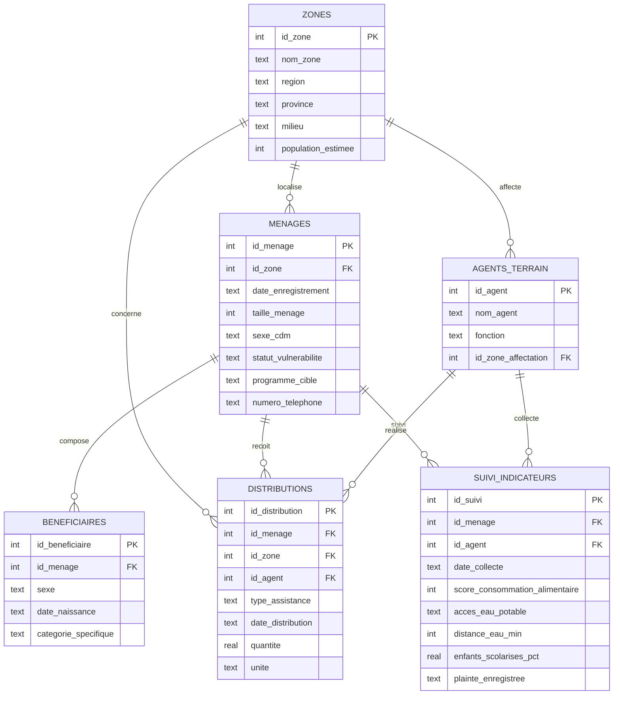

# Dictionnaire des données — Base de suivi des bénéficiaires

Base : `data/suivi_beneficiaires.db` (SQLite) — 6 tables relationnelles.

## Schéma relationnel (Mermaid)

## Détail des tables

### `zones` (9 lignes)
Zones d'intervention du programme (région, province, milieu, population estimée).

### `agents_terrain` (12 lignes)
Agents de suivi, de distribution et superviseurs, chacun affecté à une zone principale.

### `menages` (180 lignes)
Ménage bénéficiaire : zone, date d'enregistrement, taille, sexe du chef de ménage, statut de vulnérabilité (Faible/Modéré/Sévère), programme cible (Sécurité alimentaire, Cash transfert, WASH, Multisectoriel), numéro de téléphone (peut être manquant).

### `beneficiaires` (1 262 lignes)
Individus composant chaque ménage, avec sexe, date de naissance et catégorie spécifique (enfant -5 ans, enfant 5-17 ans, femme enceinte/allaitante, adulte, personne âgée, personne en situation de handicap).

### `distributions` (363 lignes)
Historique des distributions reçues par chaque ménage (vivres, cash, kit WASH, kit hygiène, intrants agricoles), avec quantité, unité, date, zone et agent responsable.

### `suivi_indicateurs` (270 lignes)
Collectes de suivi post-distribution (PDM) : score de consommation alimentaire (SCA, 0-112), accès à l'eau potable, distance au point d'eau, taux de scolarisation des enfants du ménage, plainte éventuellement enregistrée.

## Notes méthodologiques

- **Nature des données** : base **synthétique** générée pour reproduire fidèlement la structure d'une base de suivi de programme humanitaire réelle (format inspiré des standards KoboToolbox / ODK utilisés sur le terrain).
- **Anomalies volontairement introduites** (pour démontrer les requêtes d'alerte qualité) :
  - 4 numéros de téléphone partagés par deux ménages différents (doublons potentiels).
  - 5 ménages enregistrés depuis plusieurs mois sans aucune distribution reçue (gap de couverture).
  - Au moins 1 distribution "Cash" avec un montant très supérieur à la moyenne du programme (anomalie de saisie ou fraude potentielle).
- **Compatibilité** : base fournie en SQLite (`data/suivi_beneficiaires.db`, exécutable directement avec `sqlite3` ou tout client SQLite/DB Browser). Les scripts `.sql` sont écrits en SQL standard, directement portables vers PostgreSQL ou MySQL moyennant des adaptations mineures (types `SERIAL`/`AUTO_INCREMENT` à la place de `INTEGER PRIMARY KEY`, `GROUP_CONCAT` → `STRING_AGG` sous PostgreSQL, etc.).
